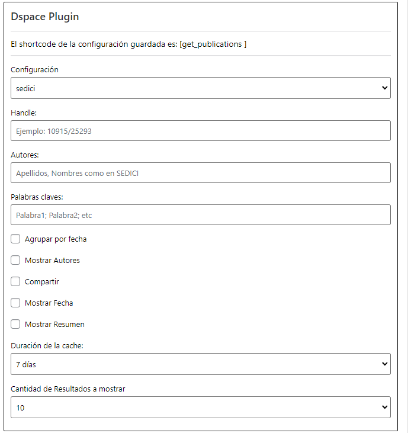

Plugin de Dspace
================

--------------

Acerca de
---------

El plugin de Dspace es fundamental se encarga de conectarse en distintos
repositorios ( Sedici / Cic Digital / Conicet) para traer información de
los mismos. Por un lado es la base para que pueda funcionar el plugin de
Personal y también nos sirve para traer todas las publicaciónes de una
coleccion específica.

Comenzando a utilizar el plugin
-------------------------------

Para empezar, el administrador debe activar el plugin de Dspace. Luego
de eso debemos configurar, se puede hacer de dos formas: \* La primera
opción es , en la barra lateral izquierda del Escritorio del sitio, ir a
Apariencia >> Widgets . Desde ahi se pueden configurar los parametros de
una forma fácil, para hacerlo se debe agregar el bloque Dspace en la
zona de Widgets inactivos. Luego de seguir los pasos se muestra la
siguiente intefaz:

   VistaConfiguracionDspace

-  La segunda opción es agregar los parametros manualmente, usando como
   guía la próxima seccion de este manual.

Luego de que se configure el plugin de cualquiera de las dos formas,
tendremos el shortcode listo para usar.

Parametros para el shortcode
----------------------------

-  ``[get_publications config='x']`` - Config: Indica que repositorio
   vamos a usar para recolectar la informacion. Los valores posibles son
   sedici, cic y conicet.
-  ``[get_publications handle='x']`` - Handle: Indica el "código" del
   perfil de autor / coleccion sobre el que queremos buscar
   publicaciones .
-  ``[get_publications author='x']`` - Author: Nombre del autor/es de
   los que queremos traer publicaciones .
-  ``[get_publications max_results='x']`` - Max Results: Indica la cantidad máxima de resultados que queremos que el shortcode muestre.
-  ``[get_publications group_date='x']`` - Group Date: Acepta dos valores "true" o "false", si esta en true muestra las publicaciones agrupadas por fecha.
-  ``[get_publications description='x']`` - Description: Acepta dos valores "true"o "false", si esta en true muestra la descripción.
-  ``[get_publications share='x']`` - Description: Acepta dos valores "true"o "false", si esta en true muestra los botones para compartir cada publicacion en distintas redes sociales

