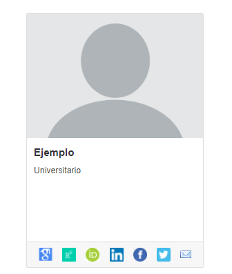
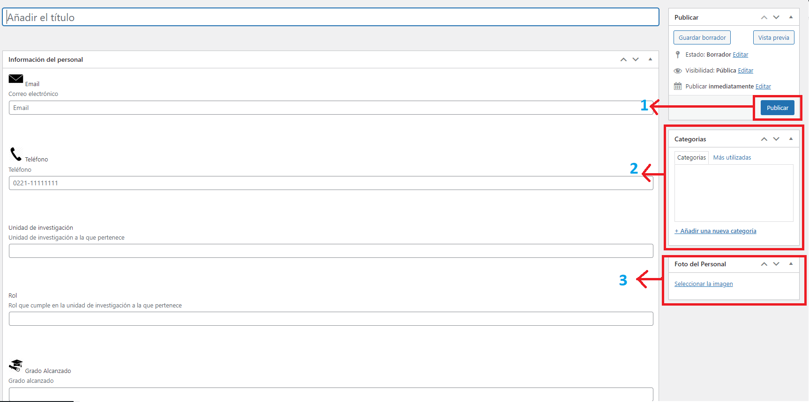

Plugin de Personal
==================

--------------

Acerca de
---------

El plugin de Personal esta enfocado en representar al personal académico de cada equipo que nos solicite un sitio web. La idea es armar un perfil
de cada investigador con sus trabajos realizados y sus redes sociales
academicas. 
**Ejemplo vista de un personal cargado:** |Ejemplo|

Campos de cada persona
----------------------

**(No es obligatorio completar todos)**

-  Nombre y apellido
-  Enlace a redes academicas (Google Scholar, Publons, Scopus, etc)
-  Enlace a redes sociales (Facebook, Twitter, Instagram)
-  Nombre del autor en repositorios (Sedici / Cic Digital / Conicet)

Comenzando a utilizar el plugin
-------------------------------

Para empezar, el administrador debe activar el plugin de Dspace y luego
el plugin de Personal, una vez hecho esto aparecera en la barra lateral
izquierda del escritorio una nueva opción llamada "Personal". Al acceder
a esa opción se puede ver todo el personal cargado hasta el momento y
también esta la ópcion de cargar una nueva persona. 

Creando un nuevo Personal
-------------------------------

Cuando ingreses a **Agregar Personal** veras la siguiente interfaz:
|InterfazCarga|

-  **1) Publicar:** Una vez cargados todos los campos deseados se debe
   clickear aqui para actualizar y guardar al personal.

-  **2) Categoria:** Una de las funcionalidades que veremos mas
   adelante, es la de listar personal según su categoria
   (Director,becario,investigador,etc). Para eso debes crear las
   categorias deseadas y en cada Persona seleccionar la categoria que
   corresponda.

-  **3) Foto del personal:** Desde aqui se puede seleccionar la foto de
   perfil que queremos que tenga la persona.

-  Todos los campos para cargar son los que aparecen en el centro de la
   pantalla.

